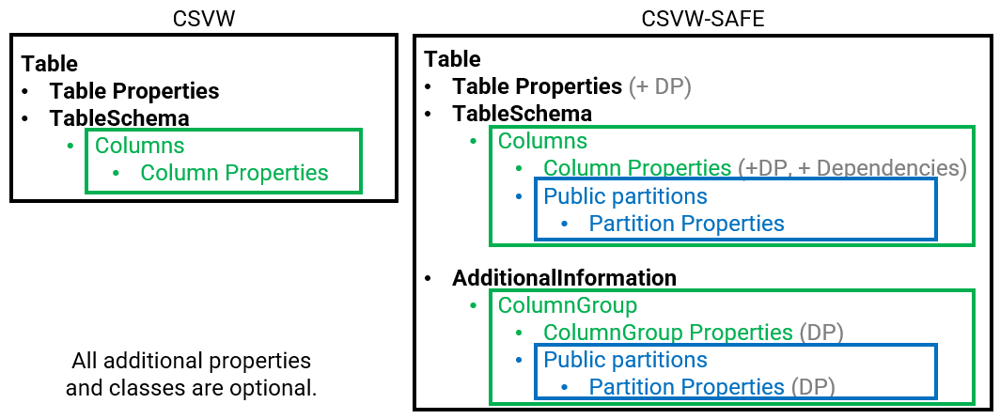
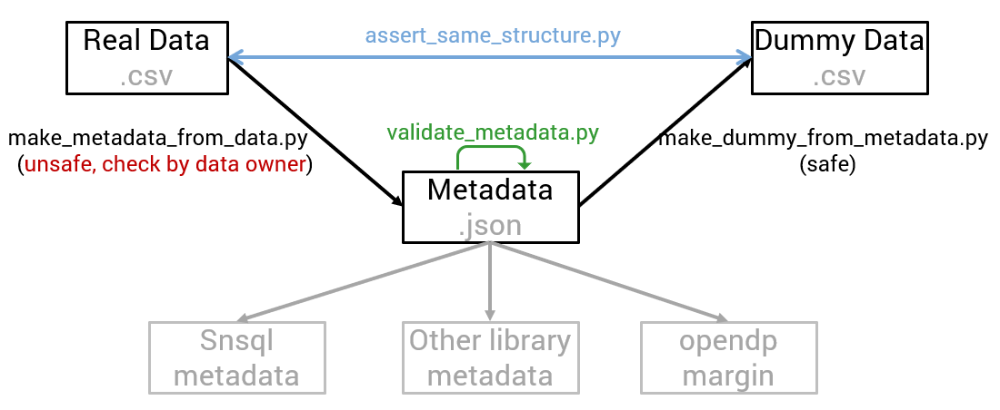

# CSVW Safe Modeling Extension (CSVW-SAFE) Vocabulary

THIS IS WORK IN PROGRESS!!!!!!!

## Overview

Many datasets cannot be directly shared due to privacy, legal, or governance constraints.
However, it is often possible, and highly valuable, to share safe, public assumptions about their structure.

These assumptions may include:

* Structural information (schema, keys, allowed partitions)
* Statistical characteristics (null proportions, value domains, approximate cardinalities)
* Logical constraints between columns
* Bounds on how individuals may contribute to the dataset

Such metadata enables:

* Automatic computation of worst-case sensitivity for Differential Privacy (DP)
* Generation of structurally valid dummy datasets
* Safe data discovery without direct access to the underlying data
* Interoperating with existing CSVW tooling and DP libraries

The core [CSV on the Web (CSVW)](https://www.w3.org/TR/tabular-data-model/) vocabulary describes tabular structure but cannot express these additional safe modeling assumptions.

**CSVW-SAFE** extends CSVW with a declarative, machine-readable vocabulary for describing public, non-sensitive constraints and assumptions about tabular datasets (not measured properties).

It does not guarantee privacy by itself. 
It enables automated computation of query sensitivity for differential privacy mechanisms.

See:

* [Guidelines and notes](https://github.com/dscc-admin-ch/csvw-safe/blob/main/documentation/guidelines.md)
* [DP libraries overview](https://github.com/dscc-admin-ch/csvw-safe/blob/main/documentation/dp_libraries.md)
* Example metadata: [Penguin dataset.json](https://github.com/dscc-admin-ch/csvw-safe/blob/main/manual_penguin_metadata.json) of the sklearn penguin dataset

---


## 1. Overview

* **Default namespace:** `https://w3id.org/csvw-safe#`
* **Vocabulary definitions:** `csvw-safe-vocab.ttl`
* **JSON-LD context:** `csvw-safe-context.jsonld`


CSVW-SAFE models three independent aspects of a dataset:
| Aspect                 | Question answered                                |
| ---------------------- | ------------------------------------------------ |
| Structure              | What values and partitions are valid?            |
| Contribution           | How much can one individual affect results?      |


In CSVW-SAFE, there are 4 main objects on which the properties apply:
| Class                   | Purpose                        |
| ----------------------- | ------------------------------ |
| `csvw:Table`            | Dataset-level guarantees       |
| `csvw:Column`           | Column schema and grouping key |
| `csvw-safe:ColumnGroup` | Multi-column grouping key      |
| `csvw-safe:Partition`   | A possible group of rows       |

- `csvw:Table` and `csvw:Column` are tables and columns as described in `csvw`.
- `csvw-safe:ColumnGroup` represents a group of columns. It is useful to describe contributions and partitions after a groupby on a group of columns.
- A `csvw-safe:Groupable:` is any object that can produce partitions when used in a grouping operation. It defines a partitioning space. `csvw:Column` and `csvw-safe:ColumnGroup` are `Groupable`.
- A `csvw-safe:Groupable:` does not define partitions unless `csvw-safe:publicPartitions` is declared.
- If `csvw-safe:publicPartitions` is declared, it contains a list of `csvw-safe:Partition`.
- A `csvw-safe:Partition` represents one possible group of rows. For details on `csvw-safe:Partition`, see point 2.4 below.
CSVW-SAFE structural and contribution properties apply on these four main classes. 



A grouping scope is determined by the grouping key of the query:
| Query type                | Governing scope           |
| ------------------------- | ------------------------- |
| No GROUP BY               | table                     |
| GROUP BY column           | that column               |
| GROUP BY multiple columns | corresponding ColumnGroup |
| Histogram over partitions | partition set             |

Implementations MUST select the nearest parent Groupable object.

For a query grouped by key G: Contribution bounds must be taken from the Groupable object representing G.
If not present, bounds are inherited from the nearest parent scope.
Order: 
```
Partition → ColumnGroup → Column → Table
```


## 2. Structural Modeling Extensions

Structural metadata supports:

- Dummy dataset generation (generate a dataset that has the same schema and structure as the original dataset) for functionnel programming for instance.
- Public schema discovery (can already answer some questions without requiring private data access).

All standard CSVW column properties (`datatype`, `format`, `minimum`, `maximum`, `required`, `default`) are re-used as is.
In particular, for continuous columns, `minimum` and `maximum` are compusory to apply DP.

### 2.1 All Levels

| Name                     | Table | Partition | Column (fixed) | Groupable object       |
|--------------------------|------:|----------:|---------------:|------------------------|
| maxLength                | Yes   | Yes       | No             | Yes**                  |
| publicLength             | Yes   | Yes       | No             | Yes***                 |
| maxNumPartitions         | No    | No        | Yes            | Yes                    |
| publicPartitions         | No    | No        | Yes            | Yes                    |

Yes**/*: If given, it is interpreted as a applied on all resulting partitions.

`csvw-safe:maxLength` is the maximum theoretical number of rows. Is also enables to compute additional noise requirements in case of overflow when doing some operations. See reference: [Casacuberta et al., 2022](https://dl.acm.org/doi/pdf/10.1145/3548606.3560708).
- At the table level, it is the maximum theoretical number of rows in the table. It is compulsory to apply DP.
- At the partition level, it is the maximum theoretical number of rows in the partition.
- If given at the groupable level, it is an upper bound on the number of rows in any resulting partition. (Yes**)

`csvw-safe:publicLength` is the exact number of rows if it is known (if it is public information). This is only safe if the length is invariant across neighbouring datasets (invariant under the adjacency relation). If given, it can save budget for some operations. For instance, for a mean, all the budget is spent for the sum and then divided by publicLength instead of splitting the budget in half for a count and a sum.
- At the table level, it is the number of rows in the table. 
- At the partition level, it is the number of rows in the partition.
- If given at the groupable level, it means it is the number or rows of this value for all partitions (all partitions have this same length - be careful, this is rarely true). (Yes***)

`csvw-safe:maxNumPartitions` is the maximum number of partitions after a groupby operations. It applies to Groupable objects.
- At the column level, it is the number of different categories in the column.
- At the group of columns level, it is the number of different partitions that can be produced by grouping multiple columns (cartesian product of the partitions of each column in the simplest case).

`csvw-safe:publicPartitions` is the known public partitions in a column or group of column. They are made of `csvw-safe:Partition` (see section 2.3 on partitions level structural properties).
- At the column level, it is the list of public `csvw-safe:Partition` of a given column.
- At the group of columns level, it is the list of public `csvw-safe:Partition` produced by grouping multiple columns.

If all partitions are public and given in `csvw-safe:publicPartitions`, then `csvw-safe:exhaustivePartitions` is True, otherwise, it is False. `csvw-safe:exhaustivePartitions` applies to `csvw-safe:Groupable` objects.
Null values form an implicit partition unless prohibited by `required=true`.


### 2.2 Column-Level Structural Properties

For structural purposes, other fields exist on the `csvw:Column`:

| Term                           | Type                                  | Meaning                                             |
| ------------------------------ | ------------------------------------- | --------------------------------------------------- |
| `csvw-safe:privacyId`          | boolean                               | True if column identifies individuals/units         |
| `csvw-safe:nullableProportion` | decimal (0–1)                         | Approximate fraction of null values                 |
| `csvw-safe:dependsOn`          | column reference                      | Declares dependency on another column               |
| `csvw-safe:how`                | enum (`bigger`, `smaller`, `mapping`) | Type of dependency                                  |
| `csvw-safe:mapping`            | object                                | Required if `how = mapping`                         |

**Dependency Rules**
- `dependsOn` and `how` MUST be provided together.
- If `how = mapping`, then `mapping` MUST be provided.

**Notes**
- nullableProportion improves modeling beyond csvw:required.
- maxNumPartitions describes grouping universe size but does not affect sensitivity unless combined with DP bounds.
- multiple columns may have `csvw-safe:privacyId=true`. In these cases, DP contributions (section 3) must be provided per privacy unit.

### 2.3 ColumnGroup-Level Structural Properties
`csvw-safe:ColumnGroup` represents a grouping key composed of multiple columns

| Property            | Meaning                             |
| ------------------- | ----------------------------------- |
| `csvw-safe:columns` | Ordered list of constituent columns |

If a `csvw-safe:ColumnGroup` is declared, all referenced columns must exist in the table schema.

A `ColumnGroup` defines a joint grouping space. It does not automatically enumerate all combinations; explicit partitions may optionally restrict this space (see Partitions-Level below).

### 2.4 Partition-Level Structural Properties

A `csvw-safe:publicPartitions` is a list of `csvw-safe:Partition` based on
- A categorical value
- A numeric interval
- A composite multi-column constraint

A partition is a publicly defined subset of rows determined solely by public attributes.
A row belongs to a partition iff it satisfies its `PartitionKey` constraints. A `csvw-safe:Partition` is the conjunction of one or more PartitionKey objects.


Partitions are used to define:
- histogram buckets
- grouping outputs
- contribution bounds

Partition-level bounds MUST be <= bounds of their parent scope.

If all `csvw-safe:Partition` are given in `csvw-safe:publicPartitions` then `csvw-safe:exhaustivePartitions` is True, otherwise, it is False.

A `csvw-safe:PartitionKey` is defined by:

| Property                   | Type                           | Meaning                                           |
| -------------------------- | ------------------------------ | ------------------------------------------------- |
| `csvw-safe:partitionValue` | literal                        | Categorical partition value                       |
| `csvw-safe:lowerBound`     | decimal                        | Lower bound (numeric partition)                   |
| `csvw-safe:upperBound`     | decimal                        | Upper bound (numeric partition)                   |
| `csvw-safe:lowerInclusive` | boolean                        | Whether lower bound is inclusive (default: true)  |
| `csvw-safe:upperInclusive` | boolean                        | Whether upper bound is inclusive (default: false) |
| `csvw-safe:components`     | map → `csvw-safe:PartitionKey` | Identifier of partition for multiple columns      |

For `csvw:Column` with categorical data, the partition can be identified by `csvw-safe:partitionValue`.
```
{
  "name": "sex",
  "datatype": "string",
  "csvw-safe:publicPartitions": [
    {
      "@type": "csvw-safe:PartitionKey",
      "csvw-safe:partitionValue": "MALE"
    },
    {
      "@type": "csvw-safe:PartitionKey",
      "csvw-safe:partitionValue": "FEMALE"
    }
  ]
}
```
For `csvw:Column` with continous data, the partition can be identified by `csvw-safe:lowerBound`, `csvw-safe:upperBound`, `csvw-safe:lowerInclusive` and `csvw-safe:upperInclusive` fields.
```
{
  "name": "flipper_length_mm",
  "datatype": "double",
  "minimum": 150.0,
  "maximum": 250.0,
  "csvw-safe:publicPartitions": [
    {
      "@type": "csvw-safe:PartitionKey",
      "csvw-safe:lowerBound": 150.0,
      "csvw-safe:upperBound": 200.0
    },
    {
      "@type": "csvw-safe:PartitionKey",
      "csvw-safe:lowerBound": 200.0,
      "csvw-safe:upperBound": 250.0
    }
  ]
}
```
For `csvw:ColumnGroup` with categorical data, the partition can be identified by `csvw-safe:components` and then a partition per column.
```
{
  "@type": "csvw-safe:ColumnGroup",
  "csvw-safe:columns": ["sex", "island"],
  "csvw-safe:publicPartitions": [
    {
      "@type": "csvw-safe:Partition",
      "csvw-safe:components": {
        "sex": {
          "@type": "csvw-safe:PartitionKey",
          "csvw-safe:partitionValue": "MALE"
        },
        "island": {
          "@type": "csvw-safe:PartitionKey",
          "csvw-safe:partitionValue": "Torgersen"
        }
      }
    }
  ]
}
```
Similarly for a `csvw:ColumnGroup` with categorical and continuous data, the partition can be identified by `csvw-safe:components` and then a partition per column.
```
{
  "@type": "csvw-safe:ColumnGroup",
  "csvw-safe:columns": ["sex", "flipper_length_mm"],
  "csvw-safe:publicPartitions": [
    {
      "@type": "csvw-safe:Partition",
      "csvw-safe:components": {
        "sex": {
          "@type": "csvw-safe:PartitionKey",
          "csvw-safe:partitionValue": "MALE"
        },
        "flipper_length_mm": {
          "@type": "csvw-safe:PartitionKey",
          "csvw-safe:lowerBound": 150.0,
          "csvw-safe:upperBound": 200.0,
        }
      }
    }
  ]
}
```


## 3. Differential Privacy Extensions

A privacy unit defines dataset adjacency. Two datasets are neighbours if and only if all rows associated with one value of the privacy unit are added or removed.

CSVW-SAFE assumes bounded user-level differential privacy where neighboring datasets differ by all rows associated with one or more privacy units. 
When multiple privacy units exist, guarantees apply independently per privacy unit and mechanisms must be parameterized by the chosen privacy unit. DP guarantees apply per declared unit independently.

Partitions referenced in contribution bounds are defined relative to a grouping space, not the physical table.

A privacy unit is an identifier representing an individual or entity whose data must be protected (e.g. `patient_id`, `user_id`, `hospital_id`).

Contribution bounds describe how much influence one privacy unit can have on the output.

### 3.1 Contribution Concepts

For a given privacy unit, three quantities are tracked:
| Symbol     | Meaning                       | Metadata property                   |
| ---------- | ----------------------------- | ----------------------------------- |
| $l_\infty$ | maximum rows per partition    | `csvw-safe:maxContributions`        |
| $l_0$      | number of partitions affected | `csvw-safe:maxInfluencedPartitions` |
| $l_1$      | total rows affected           | derived: $l_1 = l_0 \cdot l_\infty$ |

These parameters allow systems to determine the maximum number of rows that may change if one privacy unit is added or removed.
The total number of rows a privacy unit may influence is: $l_1=l_0 * l_\infty$.


### 3.1 All Levels Privacy Fields

These properties must appear at table level and are optional at partition and groupable object level.

| Name                                        | Table | Partition | Column (fixed) | Groupable object       |
|---------------------------------------------|------:|----------:|---------------:|------------------------|
| `csvw-safe:contributions`                   | Yes   | Yes       | No             | Yes**                  |

Yes**/*: If given, it is interpreted as a applied on all resulting partitions.


A `csvw-safe:ContributionKey` defines contribution bounds for a specific privacy unit and determines the adjacency relation used for differential privacy guarantees.

Two datasets are considered neighbors if they differ only in rows belonging to a single privacy unit, bounded by the declared contribution parameters.
| Name                                | Table | Partition | Column (fixed) | Groupable object       |
|-------------------------------------|------:|----------:|---------------:|------------------------|
| `csvw-safe:maxContributions`        | Yes   | Yes       | No             | Yes**                  |
| `csvw-safe:maxInfluencedPartitions` | No    | No        | No             | Yes (grouping concept) |

`csvw-safe:maxContributions` is the maximum number of rows belonging to the same privacy unit within a single partition.
- At the table level, it is the maximum number of rows a privacy unit may contribute to the entire dataset. This bound governs sensitivity of queries without grouping. It is compulsory to apply DP.
- At the partition level, it is the maximum number of rows in the partition which concern the privacy unit.
- If given at the groupable level, it is an upper bound on the maxiumum number of rows which concern the privacy unit in any resulting partition. When grouping is used, the governing bound is the groupable scope. (Yes**)

`csvw-safe:maxInfluencedPartitions` is the maximum number of partitions in which the same privacy unit may appear. It is evaluated relative to the grouping key used in the query; different grouping keys induce different adjacency partitions.
- At the groupable level, it is the maximum number of partitions a privacy unit can affect.


#### 3.2 Contribution properties at privacy unit level

Contribution bounds must be associated with a specific privacy unit.
If a dataset contains multiple privacy units, each must define its own bounds.

```
{
  "@type": "csvw:Column",
  "name": "disease",
  "csvw-safe:contributions": [
    {
      "@type": "csvw-safe:ContributionKey",
      "csvw-safe:privacyUnit": "patient_id",
      "csvw-safe:maxInfluencedPartitions": 10,
      "csvw-safe:maxContributions": 20
    },
    {
      "@type": "csvw-safe:ContributionKey",
      "csvw-safe:privacyUnit": "hospital_id",
      "csvw-safe:maxInfluencedPartitions": 2,
      "csvw-safe:maxContributions": 20
    }
  ]
}
```

#### 3.3 Minimum Metadata for Worst-Case Sensitivity

Some fields are compulsory:
- Table-level (for all privacy unit)
    - `csvw-safe:maxLength` (see [Casacuberta et al., 2022](https://dl.acm.org/doi/pdf/10.1145/3548606.3560708))
    - `csvw-safe:maxContributions` (for sensitivity)
- Continuous columns when column participates in numeric aggregation:
    - `minimum` (for sensitivity)
    - `maximum` (for sensitivity)

Declaring bounds at grouping or partition level is optional but recommended.
Providing tighter bounds reduces worst-case sensitivity and thus allows lower noise addition under a fixed privacy budget.

---


## 4. Constraints

CSVW-SAFE enforces constraints to ensure both semantic correctness and DP validity. Constraints apply at table, column, multi-column group, and partition levels.

All constraints assume the recursive `csvw-safe:PartitionKey` / `csvw-safe:components` model.

### 4.1 Table-Level Constraints

Applied to `csvw:Table`:

| Property                                   | Constraint / Rule                                                 |
| ------------------------------------------ | ----------------------------------------------------------------- |
| `csvw-safe:publicLength` (if declared)     | Must be ≤ `csvw-safe:maxLength`                                   |
| `csvw-safe:maxLength`                      | Defines the global upper bound for the dataset (single partition) |
| `csvw-safe:maxContributions`                | ≤ `csvw-safe:maxLength`                                           |
| `csvw-safe:maxNumPartitions` (if declared) | Structural upper bound on grouping universe                       |


### 4.2 Column-Level Constraints

Applied to `csvw:Column` used as a grouping key:

| Rule                                                    | Meaning / Enforcement                                                    |
| ------------------------------------------------------- | ------------------------------------------------------------------------ |
| `csvw-safe:publicPartitions` values                     | Must match column datatype (`string`, `number`, etc.)                    |
| `csvw-safe:lowerBound ≤ csvw-safe:upperBound` (numeric) | Numeric partitions must have consistent bounds                           |
| `csvw-safe:lowerInclusive`, `csvw-safe:upperInclusive`  | Must be boolean if numeric bounds are declared                           |

Note: Optional columns may declare null fractions; this can affect `csvw-safe:maxLength` calculations.


### 4.3 Multi-Column Grouping Worst-Case Bounds

For `csvw-safe:ColumnGroup` entities:

| Property                            | Worst-case derivation / Rule                                                                                        |
| ----------------------------------- | ------------------------------------------------------------------------------------------------------------------- |
| `csvw-safe:maxLength`               | ≤ `min(csvw-safe:maxLength)` of parent grouping scopes containing identical `privacyUnit`                           |
| `csvw-safe:maxNumPartitions`        | ≤ product of per-column `csvw-safe:maxNumPartitions`                                                                |
| `csvw-safe:maxInfluencedPartitions` | ≤ `min(csvw-safe:maxInfluencedPartitions)` of parent grouping scopes containing identical `privacyUnit`             |
| `csvw-safe:maxContributions`        | ≤ `min(csvw-safe:maxContributions)` of parent grouping scopes containing identical `privacyUnit`                    |
| `csvw-safe:publicPartitions`        | Must represent a subset of the Cartesian product of per-column partitions, expressed via `csvw-safe:components`     |


Notes:
- Declaring csvw-safe:publicPartitions is only allowed if all columns in the group declare `csvw-safe:publicPartitions`.
- csvw-safe:components in each partition key must reference columns in csvw-safe:columns, and the referenced columns must exist in the table schema.

Additional Group-Level Rules
| Rule                                                                    | Meaning / Enforcement                                             |
| ----------------------------------------------------------------------- | ----------------------------------------------------------------- |
| If any column lacks `csvw-safe:publicPartitions`                        | The group **must not declare** `csvw-safe:publicPartitions`       |
| If any column lacks `csvw-safe:maxNumPartitions`                        | The group **must not declare** `csvw-safe:maxNumPartitions`       |
| `csvw-safe:components` keys must match `csvw-safe:columns`              | Structural consistency                                            |
| Partition values in `csvw-safe:components` must respect column datatype | Type correctness                                                  |
| Overrides of DP bounds in `csvw-safe:PartitionKey`                      | Allowed but must be ≤ group-level DP bounds                       |


Notes:
- The recursion of `csvw-safe:PartitionKey` ensures both categorical and numeric dimensions are validated consistently.
- Each `csvw-safe:PartitionKey` in `csvw-safe:components` inherits bounds from the parent unless explicitly overridden.


### 4.4 Partition-Level Constraints

Applied to `csvw-safe:PartitionKey`:

| Rule                                                                                                | Meaning / Enforcement                                  |
| --------------------------------------------------------------------------------------------------- | ------------------------------------------------------ |
| Structural partition represents a single group                                                      | Implicit `csvw-safe:maxNumPartitions = 1`              |
| `csvw-safe:components` keys must match parent grouping columns                                      | Structural consistency                                 |
| Categorical partitions must declare `csvw-safe:partitionValue`                                      | Required for categorical columns                       |
| Numeric partitions must declare `csvw-safe:lowerBound` and `csvw-safe:upperBound`                   | Required for numeric columns                           |
| Numeric bounds must satisfy `lowerBound ≤ upperBound`                                               | Interval validity                                      |
| DP bounds (`csvw-safe:maxLength`, `csvw-safe:maxInfluencedPartitions`, `csvw-safe:maxContributions`) | Must be ≤ bounds declared at parent grouping key level |
| `csvw-safe:publicLength` (if declared)                                                              | Must be ≤ `csvw-safe:maxLength`                        |


> SHACL enforcement for all levels: [`csvw-safe-constaints.ttl`](https://github.com/dscc-admin-ch/csvw-safe/blob/main/csvw-safe-constaints.ttl)

---
## 5. Utility Files

This library provides Python utilities for generating, validating, and testing CSVW-SAFE metadata and associated dummy datasets for differential privacy (DP) development and safe data modeling workflows.

It includes four main scripts:

1. make_metadata_from_data.py
2. make_dummy_from_metadata.py
3. validate_metadata.py
4. assert_same_structure.py

This is available in a pip library `csvw-safe-lib` described in [the README.md of `csvw-safe-lib`](https://github.com/dscc-admin-ch/csvw-safe/blob/main/csvw-safe-library/README.md).



## 6. CSVW-SAFE Framework

| File                          | Purpose                             |
| ----------------------------- | ----------------------------------- |
| `README.md`                   | Description, Motivation             |
| `csvw-safe-vocab.ttl`         | Vocabulary definition (OWL + RDFS)  |
| `csvw-safe-context.jsonld`    | JSON-LD context                     |
| `csvw-safe-constraints.ttl`   | SHACL validation rules              |
| `penguin_metadata.json`       | Example metadata                    |
| `dp_libraries.md`             | Mapping to DP libraries             |
| `validate_metadata.py`        | Metadata validator                  |
| `make_metadata_from_data.py`  | Infer baseline CSVW metadata        |
| `make_dummy_from_metadata.py` | Dummy data generator                |
| `assert_same_structure.py`    | Verify functional programming valid on dummy will be valid on real data |

---

