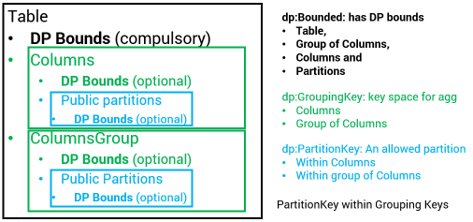

# CSVW Safe Modeling Extension (CSVW-SAFE) Vocabulary

THIS IS WORK IN PROGRESS!!!!!!! Files are not consistend with each other yet.

## Overview

Many datasets cannot be directly shared due to privacy, legal, or governance constraints.
However, it is often possible, and highly valuable, to share safe, public assumptions about their structure.

These assumptions may include:

* Structural information (schema, keys, allowed partitions)
* Statistical characteristics (null proportions, value domains, approximate cardinalities)
* Logical constraints between columns
* Bounds on how individuals may contribute to the dataset

Such metadata enables:

* Automatic computation of worst-case sensitivity for Differential Privacy (DP)
* Generation of structurally valid dummy datasets
* Safe data discovery without direct access to the underlying data
* Interoperability with DP libraries

The core [CSV on the Web (CSVW)](https://www.w3.org/TR/tabular-data-model/) vocabulary describes tabular structure but cannot express these additional safe modeling assumptions.

**CSVW-SAFE** extends CSVW with a declarative, machine-readable vocabulary for describing public, non-sensitive constraints and assumptions about tabular datasets.

This extension allows:

* Declaring safe structural and statistical properties of columns and groups
* Expressing logical relationships between columns
* Defining partition universes and grouping semantics
* Attaching contribution bounds required for Differential Privacy
* Generating dummy datasets consistent with known structure
* Interoperating with existing CSVW tooling and DP libraries


### Specification Structure

This document is organized into:

1. Structural Modeling Extensions
2. Differential Privacy Extensions
3. Differential Privacy Extensions
4. Grouping Keys
5. Public Partitions
6. Constraints
7. Utility Files
8. Summaries

See:

* [Guidelines and notes](https://github.com/dscc-admin-ch/csvw-safe/blob/main/documentation/guidelines.md)
* [DP libraries overview](https://github.com/dscc-admin-ch/csvw-safe/blob/main/documentation/dp_libraries.md)
* Example metadata: [Penguin dataset.json](https://github.com/dscc-admin-ch/csvw-safe/blob/main/manual_penguin_metadata.json) of the sklearn penguin dataset

---


## 1. Namespaces and Definitions

* **Default namespace:** `https://w3id.org/csvw-safe#`
* **Vocabulary definitions:** `csvw-safe-vocab.ttl`
* **JSON-LD context:** `csvw-safe-context.jsonld`


## 2. Structural Modeling Extensions

Structural metadata supports:

- Dummy dataset generation
- Public schema discovery
- Modeling assumptions independent of DP

All standard CSVW column properties (`datatype`, `format`, `minimum`, `maximum`, `required`, `default`) are re-used as is.

### 2.1 Column-Level Structural Properties

Applied to `csvw:Column` only:

| Term                           | Type                                  | Meaning                                             |
| ------------------------------ | ------------------------------------- | --------------------------------------------------- |
| `csvw-safe:privacyId`          | boolean                               | True if column identifies individuals/units         |
| `csvw-safe:nullableProportion` | decimal (0–1)                         | Approximate fraction of null values                 |
| `csvw-safe:dependsOn`          | column reference                      | Declares dependency on another column               |
| `csvw-safe:how`                | enum (`bigger`, `smaller`, `mapping`) | Type of dependency                                  |
| `csvw-safe:mapping`            | object                                | Required if `how = mapping`                         |
| `csvw-safe:maxNumPartitions`   | integer                               | Structural upper bound on number of distinct groups |
| `csvw-safe:publicPartitions`   | array of `csvw-safe:PartitionKey`     | Public key                                          |

**Dependency Rules**
- dependsOn and how MUST be provided together.
- If how = mapping, then mapping MUST be provided.

**Notes**
- nullableProportion improves modeling beyond csvw:required.
- maxNumPartitions describes grouping universe size but does not affect sensitivity unless combined with DP bounds.


## 3. Differential Privacy Extensions

CSVW-SAFE aligns with common DP libraries and enables worst-case sensitivity computation.

### 3.1 Core Classes

`csvw-safe:DPBounded`

| Class                    | Subclass Of             | Purpose                                    |
| ------------------------ | ----------------------- | ------------------------------------------ |
| `csvw-safe:DPBounded`    | –                       | Abstract class for entities with DP bounds |
| `csvw:Table`             | `csvw-safe:DPBounded`   | Table-level DP properties                  |
| `csvw-safe:GroupingKey`  | `csvw-safe:DPBounded`   | Abstract grouping space                    |
| `csvw:Column`            | `csvw-safe:GroupingKey` | Single-column grouping key                 |
| `csvw-safe:ColumnGroup`  | `csvw-safe:GroupingKey` | Multi-column grouping key                  |
| `csvw-safe:PartitionKey` | `csvw-safe:DPBounded`   | One allowed partition                      |




### 3.2 Differential Privacy Properties

The following properties apply to entities that are subclasses of `csvw-safe:DPBounded`.

These properties express worst-case contribution and partition bounds required for Differential Privacy (DP) sensitivity analysis.

They MAY be declared on:
- `csvw:Table`
- `csvw:Column` (when used as grouping key)
- `csvw-safe:ColumnGroup`
- `csvw-safe:PartitionKey`

#### 3.2.1 DP Properties

| Property                            | Meaning                                                              | Applicability                                       |
| ----------------------------------- | -------------------------------------------------------------------- | --------------------------------------------------- |
| `csvw-safe:maxLength`               | Maximum number of rows in a partition                                | Table, Column (grouping), ColumnGroup, PartitionKey |
| `csvw-safe:maxContribution`         | Maximum rows contributed by one individual within a single partition | Table, Column (grouping), ColumnGroup, PartitionKey |
| `csvw-safe:maxInfluencedPartitions` | Maximum number of distinct partitions an individual may affect       | Column (grouping), ColumnGroup                      |
| `csvw-safe:publicLength`            | Actual number of rows (if publicly known)                            | Table, PartitionKey                                 |

#### 3.2.2 Scope Semantics

The interpretation of each property depends on the level at which it is declared.

##### Table Level (csvw:Table)

The table is treated as a single global partition.
- csvw-safe:maxLength refers to the total dataset size (upper bound).
- csvw-safe:maxContribution refers to the maximum rows contributed by one individual in the entire dataset.
- csvw-safe:maxInfluencedPartitions is implicitly 1.
- csvw-safe:publicLength may declare the exact dataset size if publicly known.

##### Column / ColumnGroup Level (Grouping Keys)

When declared on a grouping key:
- csvw-safe:maxLength defines a global upper bound applying to all partitions induced by that grouping.
- csvw-safe:maxContribution defines the maximum per-partition contribution of one individual.
- csvw-safe:maxInfluencedPartitions defines how many distinct partitions an individual may affect.

These values are used to compute worst-case sensitivity for grouped aggregations.

##### PartitionKey Level

When declared on a specific csvw-safe:PartitionKey:
- csvw-safe:maxLength applies only to that partition.
- csvw-safe:maxContribution applies only to that partition.
- csvw-safe:publicLength may declare the exact size of that partition.

Partition-level bounds MUST be less than or equal to the bounds declared at the parent grouping level.

#### 3.2.3 Mapping to Differential Privacy Metrics

The properties map to standard DP sensitivity metrics as follows:

| DP Metric  | Meaning                               | CSVW-SAFE Term                |
| ---------- | ------------------------------------- | ----------------------------- |
| $l_0$      | Affected partitions per person        | `csvw-safe:maxInfluencedPartitions` |
| $l_\infty$ | Max contribution within one partition | `csvw-safe:maxContribution`   |
| $l_1$      | Total changed rows                    | Derived: $l_1=l_0 * l_\infty$ |

For non-grouped (table-level) queries, $l_0 = 1$ and $l_1 = csvw-safe:maxContribution$.

##### 3.2.4 Minimum Metadata for Worst-Case Sensitivity

To fully parameterize worst-case DP sensitivity:
- Table-level
    - `csvw-safe:maxLength`
    - `csvw-safe:maxContribution`
- Continuous columns
    - `minimum`
    - `maximum`

Declaring bounds at grouping or partition level is optional but recommended.
Providing tighter bounds reduces worst-case sensitivity and thus allows lower noise addition under a fixed privacy budget.

##### 3.2.5 Examples

###### 3.2.5.1 Table-Level Mapping 

`csvw:Table` is `csvw-safe:DPBounded`: the table is treated as a single large partition.
`csvw-safe:maxLength` must be provided at the table level.
`csvw-safe:maxInfluencedPartitions = 1` (one large partition).

> **Reference:** [Casacuberta et al., 2022](https://dl.acm.org/doi/pdf/10.1145/3548606.3560708)
```
{
    "@type": "csvw:Table",
    "csvw-safe:maxLength": 500,
    "csvw-safe:publicLength": 500,
    "csvw-safe:maxContribution": 2,
}
```

###### 3.2.5.2 Column Level
Columns used as grouping keys inherit all `csvw-safe:DPBounded` properties.
```
{
    "@type": "csvw:Column",
    "name": "island",
    "csvw-safe:maxLength": 100,
    "csvw-safe:maxInfluencedPartitions": 1,
    "csvw-safe:maxContribution": 2,
}
```

###### 3.2.5.3 Multi-Column Level
Multiple Columns used as grouping keys inherit all `csvw-safe:DPBounded` properties.
```
{
    "@type": "csvw-safe:ColumnGroup",
    "csvw-safe:columns": ["sex", "island"],
    "csvw-safe:maxLength": 100,
    "csvw-safe:maxInfluencedPartitions": 1,
    "csvw-safe:maxContribution": 2,
}
```


###### 3.2.5.4 Partition Level
Partitions inherit all `csvw-safe:DPBounded` properties except `csvw-safe:maxNumPartitions`, which is always 1.
A `csvw-safe:PartitionKey` inherits DP bounds from its parent `csvw-safe:GroupingKey` unless explicitly overridden.
```
{
    "@type": "csvw-safe:PartitionKey",
    "csvw-safe:partitionValue": "Torgersen",
    "csvw-safe:maxLength": 50,
    "csvw-safe:maxContribution": 2,
    "csvw-safe:publicLength": 50,
},
```


## 4. Grouping Keys

A grouping key defines a space over which aggregation or partitioning may occur.
Grouping keys can be:
- A single column
- A combination of multiple columns

#### 4.1 Grouping Keys
The following core classes define the grouping model:
| Class                    | Subclass Of             | Purpose                                     |
| ------------------------ | ----------------------- | ------------------------------------------- |
| `csvw-safe:GroupingKey`  | `csvw-safe:DPBounded`   | Abstract grouping space                     |
| `csvw:Column`            | `csvw-safe:GroupingKey` | Single-column grouping key                  |
| `csvw-safe:ColumnGroup`  | `csvw-safe:GroupingKey` | Multi-column grouping key                   |
| `csvw-safe:PartitionKey` | `csvw-safe:DPBounded`   | One allowed partition within a grouping key |

#### 4.2 Multi-Column Grouping

`csvw-safe:ColumnGroup` represents a grouping key composed of multiple columns

| Property            | Meaning                             |
| ------------------- | ----------------------------------- |
| `csvw-safe:columns` | Ordered list of constituent columns |


If a csvw-safe:ColumnGroup is declared, all referenced columns:
- MUST exist in the table schema
- MUST be listed explicitly in csvw-safe:columns
- MUST NOT include columns marked as identifiers (e.g., privacyId = true)

A `ColumnGroup` defines a joint grouping space. It does not automatically enumerate all combinations; explicit partitions may optionally restrict this space (see Public Partitions below).


## 5. Public Partitions

### 5.1 Disclosure Considerations

Declaring explicit partitions may itself reveal information.

If partition values are declared in metadata, they are assumed to be:
- Public
- Safe to disclose
- Not consuming privacy budget

Metadata authors MUST only declare partitions that are safe to expose.

### 5.2 csvw-safe:publicPartitions

`csvw-safe:publicPartitions` defines the explicit universe of allowed partitions for a grouping key.

It is an array of `csvw-safe:PartitionKey` objects.

Declaring `publicPartitions` restricts the grouping universe to the declared partitions only.

If `publicPartitions` is not declared, the grouping space is implicitly defined by the column domains.

### 5.3 PartitionKey Structure

A `csvw-safe:publicPartitions` defines a constraint over a value space.

It may represent:
- A categorical value
- A numeric interval
- A composite multi-column constraint

| Property                   | Type                           | Meaning                                           |
| -------------------------- | ------------------------------ | ------------------------------------------------- |
| `csvw-safe:partitionValue` | literal                        | Categorical partition value                       |
| `csvw-safe:lowerBound`     | decimal                        | Lower bound (numeric partition)                   |
| `csvw-safe:upperBound`     | decimal                        | Upper bound (numeric partition)                   |
| `csvw-safe:lowerInclusive` | boolean                        | Whether lower bound is inclusive (default: true)  |
| `csvw-safe:upperInclusive` | boolean                        | Whether upper bound is inclusive (default: false) |
| `csvw-safe:partitionLabel` | string                         | Optional human-readable label                     |
| `csvw-safe:components`     | map → `csvw-safe:PartitionKey` | Per-column constraints (multi-column only)        |


### 5.4 Recursive Semantics

csvw-safe:PartitionKey is recursive.

#### Single-column grouping

A partition MUST define either:

- partitionValue (categorical), or
- lowerBound / upperBound (numeric interval)

The allowed fields depend on the column datatype.


#### Multi-column grouping

For `csvw-safe:ColumnGroup`, each partition MUST define: `csvw-safe:components`.

This is a mapping: `columnName → PartitionKey`

Each referenced column:
- MUST appear in the parent csvw-safe:columns
- MUST exist in the table schema
- MUST respect its datatype

This recursive structure allows:
- categorical × categorical
- categorical × continuous
- continuous × continuous
to be modeled uniformly.

The datatype and semantics of the referenced column constrain which fields of `csvw-safe:PartitionKey` are valid (e.g. categorical vs numeric).

### 5.5 Examples

#### 5.5.1 Single Column – Categorical
```
{
  "name": "sex",
  "datatype": "string",
  "csvw-safe:publicPartitions": [
    {
      "@type": "csvw-safe:PartitionKey",
      "csvw-safe:partitionValue": "MALE"
    },
    {
      "@type": "csvw-safe:PartitionKey",
      "csvw-safe:partitionValue": "FEMALE"
    }
  ]
}
```

#### 5.5.2 Single Column – Continuous
```
{
  "name": "flipper_length_mm",
  "datatype": "double",
  "csvw-safe:publicPartitions": [
    {
      "@type": "csvw-safe:PartitionKey",
      "csvw-safe:lowerBound": 150.0,
      "csvw-safe:upperBound": 200.0,
      "csvw-safe:lowerInclusive": true,
      "csvw-safe:upperInclusive": false
    },
    {
      "@type": "csvw-safe:PartitionKey",
      "csvw-safe:lowerBound": 200.0,
      "csvw-safe:upperBound": 250.0,
      "csvw-safe:lowerInclusive": true,
      "csvw-safe:upperInclusive": true
    }
  ]
}
```

#### 5.5.3 Multi Column – Categorical × Categorical

Here, `csvw-safe:components` is used to enumerate explicit combinations (subset of Cartesian product).
Categorical
```
{
  "@type": "csvw-safe:ColumnGroup",
  "csvw-safe:columns": ["sex", "island"],
  "csvw-safe:publicPartitions": [
    {
      "@type": "csvw-safe:PartitionKey",
      "csvw-safe:components": {
        "sex": {
          "@type": "csvw-safe:PartitionKey",
          "csvw-safe:partitionValue": "MALE"
        },
        "island": {
          "@type": "csvw-safe:PartitionKey",
          "csvw-safe:partitionValue": "Torgersen"
        }
      }
    },
    {
      "@type": "csvw-safe:PartitionKey",
      "csvw-safe:components": {
        "sex": {
          "@type": "csvw-safe:PartitionKey",
          "csvw-safe:partitionValue": "FEMALE"
        },
        "island": {
          "@type": "csvw-safe:PartitionKey",
          "csvw-safe:partitionValue": "Torgersen"
        }
      }
    }
  ]
}
```

#### 5.5.3 Multi Column – Categorical × Continuous
```
{
  "@type": "csvw-safe:ColumnGroup",
  "csvw-safe:columns": ["sex", "flipper_length_mm"],
  "csvw-safe:publicPartitions": [
    {
      "@type": "csvw-safe:PartitionKey",
      "csvw-safe:components": {
        "sex": {
          "@type": "csvw-safe:PartitionKey",
          "csvw-safe:partitionValue": "MALE"
        },
        "flipper_length_mm": {
          "@type": "csvw-safe:PartitionKey",
          "csvw-safe:lowerBound": 150.0,
          "csvw-safe:upperBound": 200.0,
          "csvw-safe:lowerInclusive": true,
          "csvw-safe:upperInclusive": false
        }
      }
    }
  ]
}
```


---

## 6. Constraints

CSVW-SAFE enforces constraints to ensure both semantic correctness and DP validity. Constraints apply at table, column, multi-column group, and partition levels.

All constraints assume the recursive `csvw-safe:PartitionKey` / `csvw-safe:components` model.

### 6.1 Table-Level Constraints

Applied to `csvw:Table`:

| Property                                   | Constraint / Rule                                                 |
| ------------------------------------------ | ----------------------------------------------------------------- |
| `csvw-safe:publicLength` (if declared)     | Must be ≤ `csvw-safe:maxLength`                                   |
| `csvw-safe:maxLength`                      | Defines the global upper bound for the dataset (single partition) |
| `csvw-safe:maxInfluencedPartitions`        | Must equal 1 (table is a single partition)                        |
| `csvw-safe:maxContribution`                | ≤ `csvw-safe:maxLength`                                           |
| `csvw-safe:maxNumPartitions` (if declared) | Structural upper bound on grouping universe                       |


### 6.2 Column-Level Constraints

Applied to `csvw:Column` used as a grouping key:

| Rule                                                    | Meaning / Enforcement                                                    |
| ------------------------------------------------------- | ------------------------------------------------------------------------ |
| `required = true → csvw-safe:nullableProportion = 0`    | Required columns cannot be nullable                                      |
| `csvw-safe:privacyId = true`                            | Column must **not participate in DP aggregation** (no DP bounds allowed) |
| `csvw-safe:publicPartitions` values                     | Must match column datatype (`string`, `number`, etc.)                    |
| `csvw-safe:lowerBound ≤ csvw-safe:upperBound` (numeric) | Numeric partitions must have consistent bounds                           |
| `csvw-safe:lowerInclusive`, `csvw-safe:upperInclusive`  | Must be boolean if numeric bounds are declared                           |

Note: Optional columns may declare null fractions; this can affect `csvw-safe:maxLength` calculations.


### 6.3 Multi-Column Grouping Worst-Case Bounds

For `csvw-safe:ColumnGroup` entities:

| Property                            | Worst-case derivation / Rule                                                                                        |
| ----------------------------------- | ------------------------------------------------------------------------------------------------------------------- |
| `csvw-safe:maxLength`               | ≤ `min(csvw-safe:maxLength)` of constituent columns or inherited grouping bounds                                    |
| `csvw-safe:maxNumPartitions`        | ≤ product of per-column `csvw-safe:maxNumPartitions`                                                                |
| `csvw-safe:maxInfluencedPartitions` | ≤ `min(csvw-safe:maxInfluencedPartitions)` of constituent columns                                                   |
| `csvw-safe:maxContribution`         | ≤ `min(csvw-safe:maxContribution)` of constituent columns                                                           |
| `csvw-safe:publicPartitions`        | Must represent a **subset of the Cartesian product** of per-column partitions, expressed via `csvw-safe:components` |


Notes:
- Declaring csvw-safe:publicPartitions is only allowed if all columns in the group declare `csvw-safe:publicPartitions`.
- csvw-safe:components in each partition key must reference columns in csvw-safe:columns, and the referenced columns must exist in the table schema.

Additional Group-Level Rules
| Rule                                                                    | Meaning / Enforcement                                             |
| ----------------------------------------------------------------------- | ----------------------------------------------------------------- |
| No `csvw-safe:privacyId = true` column in group                         | Privacy identifiers cannot participate in grouped DP computations |
| If any column lacks `csvw-safe:publicPartitions`                        | The group **must not declare** `csvw-safe:publicPartitions`       |
| If any column lacks `csvw-safe:maxNumPartitions`                        | The group **must not declare** `csvw-safe:maxNumPartitions`       |
| `csvw-safe:components` keys must match `csvw-safe:columns`              | Structural consistency                                            |
| Partition values in `csvw-safe:components` must respect column datatype | Type correctness                                                  |
| Overrides of DP bounds in `csvw-safe:PartitionKey`                      | Allowed but must be ≤ group-level DP bounds                       |


Notes:
- The recursion of `csvw-safe:PartitionKey` ensures both categorical and numeric dimensions are validated consistently.
- Each `csvw-safe:PartitionKey` in `csvw-safe:components` inherits bounds from the parent unless explicitly overridden.


### 6.4 Partition-Level Constraints

Applied to `csvw-safe:PartitionKey`:

| Rule                                                                                                | Meaning / Enforcement                                  |
| --------------------------------------------------------------------------------------------------- | ------------------------------------------------------ |
| Structural partition represents a single group                                                      | Implicit `csvw-safe:maxNumPartitions = 1`              |
| `csvw-safe:components` keys must match parent grouping columns                                      | Structural consistency                                 |
| Categorical partitions must declare `csvw-safe:partitionValue`                                      | Required for categorical columns                       |
| Numeric partitions must declare `csvw-safe:lowerBound` and `csvw-safe:upperBound`                   | Required for numeric columns                           |
| Numeric bounds must satisfy `lowerBound ≤ upperBound`                                               | Interval validity                                      |
| DP bounds (`csvw-safe:maxLength`, `csvw-safe:maxInfluencedPartitions`, `csvw-safe:maxContribution`) | Must be ≤ bounds declared at parent grouping key level |
| `csvw-safe:publicLength` (if declared)                                                              | Must be ≤ `csvw-safe:maxLength`                        |


> SHACL enforcement for all levels: [`csvw-safe-constaints.ttl`](https://github.com/dscc-admin-ch/csvw-safe/blob/main/csvw-safe-constaints.ttl)

---
## 7. Utility Files

This library provides Python utilities for generating, validating, and testing CSVW-SAFE metadata and associated dummy datasets for differential privacy (DP) development and safe data modeling workflows.

It includes four main scripts:

1. make_metadata_from_data.py
2. make_dummy_from_metadata.py
3. validate_metadata.py
4. assert_same_structure.py

This is available in a pip library `csvw-safe-lib` described in [the README.md of `csvw-safe-lib`](https://github.com/dscc-admin-ch/csvw-safe/blob/main/csvw-safe-library/README.md).


## 8. Summaries

Visual Overview

```
csvw:Table ⊂ csvw-safe:DPBounded
 ├─ csvw-safe:DPBounds
 │
 ├─ csvw:tableSchema → csvw:TableSchema
 │    └─ csvw:Column ⊂ csvw-safe:GroupingKey ⊂ csvw-safe:DPBounded
 │         ├─ CSVW schema (datatype, required, default, etc.)
 │         ├─ csvw-safe:publicPartitions (DP-relevant)
 │         │    └─ csvw-safe:DPBounds
 │         └─ csvw-safe:DPBounds
 │
 └─ csvw-safe:ColumnGroup ⊂ csvw-safe:GroupingKey ⊂ csvw-safe:DPBounded
      ├─ csvw-safe:columns → rdf:List(csvw:Column)
      ├─ csvw-safe:publicPartitions (DP-relevant)
      │    └─ csvw-safe:components (structural)
      │         └─ csvw-safe:DPBounds
      └─ csvw-safe:DPBounds
```

> **Full View:** [README_details.md](https://github.com/dscc-admin-ch/csvw-safe/blob/main/documentation/README_details.md)

---

Files

| File                          | Purpose                             |
| ----------------------------- | ----------------------------------- |
| `README.md`                   | Description, Motivation             |
| `csvw-safe-vocab.ttl`         | Vocabulary definition (OWL + RDFS)  |
| `csvw-safe-context.jsonld`    | JSON-LD context                     |
| `csvw-safe-constraints.ttl`   | SHACL validation rules              |
| `penguin_metadata.json`       | Example metadata                    |
| `dp_libraries.md`             | Mapping to DP libraries             |
| `validate_metadata.py`        | Metadata validator                  |
| `make_metadata_from_data.py`  | Infer baseline CSVW metadata        |
| `make_dummy_from_metadata.py` | Dummy data generator                |
| `assert_same_structure.py`    | Verify functional programming valid on dummy will be valid on real data |

---

