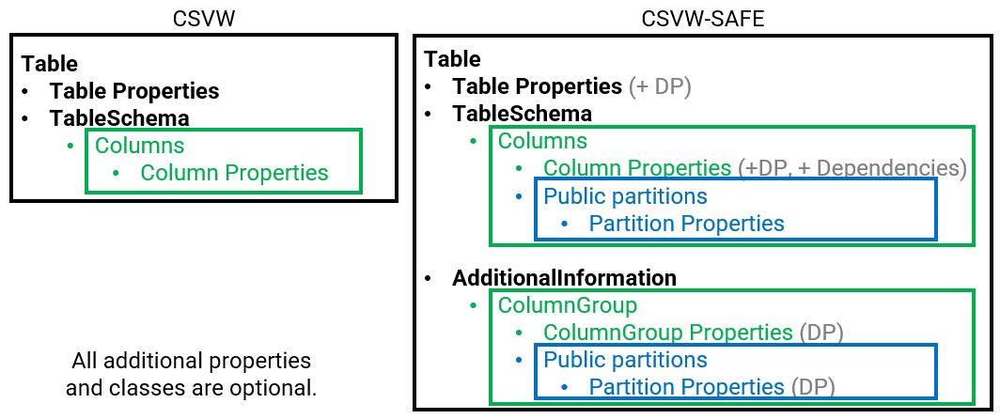
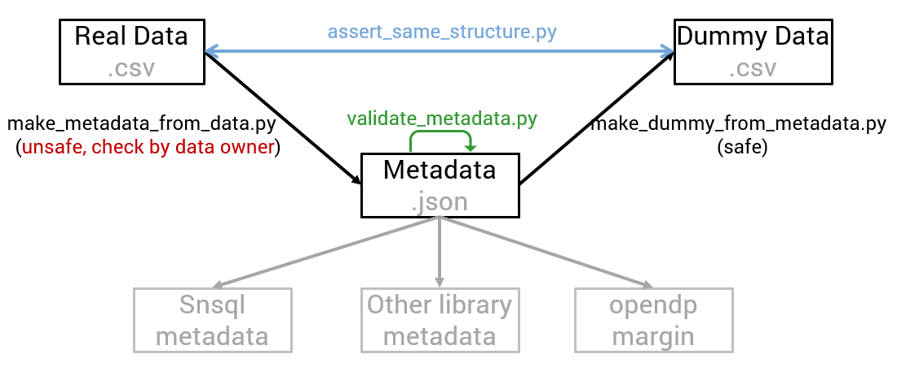

# CSVW Safe Vocabulary

## 1. Introduction

Many datasets cannot be directly shared due to privacy, legal, or governance constraints.
However, it is often possible, and highly valuable, to share safe, public assumptions about their structure.

These assumptions may include:

* Structural information (schema, keys, allowed partitions)
* Statistical characteristics (null proportions, value domains, approximate cardinalities)
* Logical constraints between columns
* Bounds on how individuals may contribute to the dataset

WARNING: Some of these assumptions may be safe to share (number of days in a month) but some might not be (how many people have a certain rare desease on a small island). Also if enough statistics are shared about a dataset, the privacy of its contributor is at risk even if the disclosed statistics seem inoffensive (see [Sweeney](https://dataprivacylab.org/projects/identifiability/paper1.pdf)). It is the role of the data administrator to make informed decisions on what is public information or not.

Such metadata enables:

* Safe data discovery without direct access to the underlying data (user can see what is available like survey from which year to which year without accessing the data)
* Generation of structurally valid dummy datasets (replicate the structure of the real dataset but has fake data)
* Automatic computation of (worst-case) sensitivity of a query for Differential Privacy (DP)

[**CSV on the Web (CSVW)**](https://www.w3.org/TR/tabular-data-model/) vocabulary already describes tabular structure (tables, columns, datatypes) but doesn't express these additional modeling assumptions (DP contributions, dependencies between rows, etc).

**CSVW-SAFE** extends CSVW for describing public, non-sensitive constraints and assumptions about tabular datasets. The information is a CSVW-SAFE metadata is not supposed to be measured properties. It should not describe the dataset itself but the set of datasets considered possible under the privacy model. All bounds must hold for every dataset in this set. (Note: the script `make_metadata_from_data.py` of `csvw-safe-library` is dangerous and should be used with parcimony. It is made to gain time but the resulting metadata should always be thoroughly checked and minimized). If too much information is shared, then the privacy of contributors of the dataset is at risk.

For DP contributions, an overview of words(metadata) used by DP library and their correspondance with **CSVW-SAFE** is available in [DP libraries overview](https://github.com/dscc-admin-ch/csvw-safe/blob/main/documentation/dp_libraries.md).

For an example, see [Penguin dataset.json](https://github.com/dscc-admin-ch/csvw-safe/blob/main/manual_penguin_metadata.json) on the penguin dataset from sklearn.


## 2. CSVW-SAFE Classes and Properties

* **Default namespace:** `https://w3id.org/csvw-safe#` (TODO: publish)
* **Vocabulary definitions:** `csvw-safe-vocab.ttl`
* **JSON-LD context:** `csvw-safe-context.jsonld`
* **SHACL Constraints:** `csvw-safe-constraints.ttl`


### 2.1 CSVW-SAFE Classes

CSVW-SAFE uses four core objects on which structural and privacy properties apply:

| Class                   | Purpose                                                 |
| ----------------------- | ------------------------------------------------------- |
| `csvw:Table`            | Table schema, global guarantees and informations        |
| `csvw:Column`           | Column schema and single-column grouping space          |
| `csvw:ColumnGroup`      | Multi-Column grouping space                             |
| `csvw-safe:Partition`   | A region of the value domain (after a groupby)          |

- `csvw:Table` are tables as described in `csvw`. A `csvw:Table` contains a `csvw:TableSchema` (with a list of `csvw:Columns`) and optionally a `csvw-safe:AdditionalInformation` (with a list of `csvw-safe:ColumnGroup` and their partitions).

- `csvw:Column` are columns as described in `csvw`. It also defines a single column grouping space.

- `csvw-safe:ColumnGroup` are groups of columns. It can define the resulting keys, partitions and contributions if a GROUP BY operation was made on this group of columns.

- A `csvw-safe:Partition` is a publicly defined region of the value domain. For instance, if a column is `month_of_year`, then each set of rows associated to a specific month is a partition (12 partitions) and can have either special contribution bounds. For instance, if a data unit can only participate to the dataset once in a day (maximum) then in the `csvw-safe:ColumnGroup` on columns `['year', 'month']`, the partition on `February 2026` has a `maxContributions` of 28 and the one of `July 2026` of 31. In `csvw-safe`, partitions are identified by their predicate.

This image presents the base `csvw` json-ld structure on the left and the extended `csvw-safe`.


All properties of `csvw-safe` apply on these four classes.

#### JSON-LD Structure
Thus from `csvw` json-ld
```bash
{
  "@type": "csvw:Table",
  "name": "penguins",
  "csvw:tableSchema": {
    "columns": [
      {
        "@type": "csvw:Column",
        "name": "penguin_id",
        "datatype": "integer"
      },
      {
        "@type": "csvw:Column",
        "name": "species",
        "datatype": "string",
      },
      ...
    ]
  }
}
```

a `csvw` json-ld would organise classes followign this structure:
```bash
{
  "@type": "csvw:Table",
  "name": "penguins",
  "csvw-safe:x": "csvw-safe_table_level_properties",
  "csvw:tableSchema": {
    "columns": [
      {
        "@type": "csvw:Column",
        "name": "penguin_id",
        "datatype": "integer",
        "csvw-safe:x": "csvw-safe_column_level_properties",
      },
      {
        "@type": "csvw:Column",
        "name": "species",
        "datatype": "string",
        "csvw-safe:public.partitions": [
          { 
            "@type": "csvw-safe:Partition", 
            "csvw-safe:predicate": { "partitionValue": "Adelie" },
            "csvw-safe:x": "csvw-safe_partition_level_properties",
          },
          ...
        ]
      },
    ]
  },
  "csvw-safe:additionalInformation": [
    {
      "@type": "csvw-safe:ColumnGroup",
      "csvw-safe:columns": ["species", "island"],
      "csvw-safe:x": "csvw-safe_columnGroup_level_properties",
      "csvw-safe:public.partitions": [
        {
          "@type": "csvw-safe:Partition",
          "csvw-safe:predicate": {
            "species": {"partitionValue": "Adelie"}, 
            "island": {"partitionValue": "Torgersen"},
          }
          "csvw-safe:x": "csvw-safe_partition_level_properties",
        },
        ....
      ]
    }
  ]
}
```
The next section describes the `csvw-safe` properties.


### 2.2 CSVW-SAFE Properties

CSVW-SAFE properties belong to two main categories:
| Aspect                                 | Describes                                                |
| -------------------------------------- | -------------------------------------------------------- |
| **Dummy modeling**               | Information for generating realistic dummy data          |
| **Contribution assumptions (for DP)**  | Worst-case assumptions on privacy unit contribution      |

These properties should only be in the metadata if their release does not consume privacy budget.
The should not depend on the observed dataset instance (not specific empirical observations) and should hold for all neighbouring datasets.

#### 2.2.1 Dummy modeling
These properties give structural information about the dataset. They mainly serve dummy data generation.

They improve the realism of synthetic datasets and dummy dataset but should not affect DP guarantees. They may be approximate proportions.

The properties are 

| Term                  | Type                                   | Meaning                                             |
| --------------------- | -------------------------------------- | --------------------------------------------------- |
| `nullableProportion`  | decimal (0–1)                          | Approximate fraction of null values                 |
| `dependsOn`           | column reference                       | Declares dependency on another column               |
| `dependencyType`      | enum (`bigger`, `fixedPerEntity`, `mapping`)  | Type of dependency                           |
| `valueMap`            | object                                 | Required if `dependencyType = mapping`, defines a mapping from the dependent column to the source column. |

- `nullableProportion` improves modeling beyond csvw:required.
- `dependsOn` and `dependencyType` MUST be provided together.

**Bigger dependency type**:
This means all values in one column are bigger than in another column. It is only useful for numerical/dates columns and if the bounds are overlapping.
Example: usually the date of a second operation during an hospitalization is bigger than the date of the first operation.

**Mapping dependency type**:
If `dependencyType = mapping`, then `valueMap` MUST be provided.

Examples:
1. Age -> Adult
  - Column `age`.
  - Column `is_adult` depends on `age`, `dependencyType = mapping`. 
  - Mapping: `valueMap = {..., 6: False, 7: False, ..., 18: True, 19: True, ...}`.

2. Occupation → Specialization:
  - Column `occupation` values: `medical`, `engineer`.
  - Column `specialization` depends on `occupation`:
    - `medical` → `nurse` or `doctor`
    - `engineer` → `Mechanical Engineering`, `Microengineering`, or `Civil Engineering`
  - Mapping: `valueMap = {'medical': ['nurse', 'doctor'], 'engineer': ['Mechanical Engineering', 'Microengineering', 'Civil Engineering']}`.

3. Treatment dates:
  - Column `first_treatment_date` exists.
  - Column `second_treatment_date` depends on `first_treatment_date`, `dependencyType = bigger`.

4. Supplementary information
  - If there are many `diagnostic_{i}` column with `i`, the number of the diagnostic and there are filled in increasing order, then if `diagnostic_{i}` is Null then `diagnostic_{i+1}` is also Null. So it depends, `how = mapping`. Mapping: `{None: None}`.

**Fixed per entity dependency type**:
`fixedPerEntity` is a type of dependency on multiple on multiple rows

Examples:
1. Person-level data:
  - Column `person_id` repeats across multiple rows.
  - Column `name` and `height` remain the same across all rows with the same `person_id`.

2. School data:
  - Column `student_id` repeats for multiple semesters.
  - Column `birth_date` is fixed for that student.

A bit like a mapping but where the keys are private (because they might belong to a privacy unit).

#### 2.2.2 Privacy/Dummy modeling: Keys disclosure

| Term                | Definition                                                             | Application Level        |
| ------------------- | ---------------------------------------------------------------------- | ------------------------ |
| `publicKeys`        | List of known partitions (publicly known regions)                      |  Column, ColumnGroup     |
| `exhaustiveKeys`    | Boolean, True if the list of `publicKeys` is exhaustive                |  Column, ColumnGroup     |
| `maxNumPartitions`  | Max number of non-empty output partitions for a column or grouping key |  Column, ColumnGroup     |
| `partitions`        | List of partitions within a grouping key and their properties          |  Column, ColumnGroup     |

`publicKeys` is the list of known public keys in a column or group of column. If the list is exhaustive `exhaustiveKeys` is True, otherwise it is False.

`maxNumPartitions` refers to the maximum number of non-empty groups that may appear in a query result, not the size of the value domain.
- At the column level, it is the number of different categories in the column. For instance, a column with 3 categories has `maxNumPartitions=3`.
- At the group of columns level, it is the number of different partitions that can be produced by grouping multiple columns (cartesian product of the partitions of each column in the simplest case).
If `partitions` is declared and `exhaustivePartitions=true`, then maxNumPartitions equals the number of declared partitions. Otherwise, `maxNumPartitions` must be explicitly declared.


`partitions` contain a list of `csvw-safe:Partition` which contain additional information on partitions on the column or group of columns.
- At the column level, it is the list of public `Partition` of a given column.
- At the group of columns level, it is the list of public `Partition` produced by grouping multiple columns.


#### 2.2.3 Contribution assumptions (for DP)

##### Privacy Unit
A privacy unit is an identifier representing an individual or entity whose data must be protected (e.g. `patient_id`, `user_id`, `hospital_id`) and a privacy unit participation defines dataset adjacency. Two datasets are neighbours if and only if all rows associated with one privacy unit are added or removed.
`csvw-safe` define worst-case contribution bounds required for DP calibration (maximum influence one privacy unit may have on a query result).
They must hold for all datasets consistent with the declared public constraints and are guarantees about the possible universe of neighbouring datasets.

| Term                 | Type         | Meaning                                             | Application Level |
| -------------------- | ------------ | --------------------------------------------------- | ----------------- |
| `privacyUnit`        | str          | Name of the column that is a privacy id             | Table             |
| `privacyId`          | boolean      | True if column identifies privacy units             | Column            |


For now, `csvw-safe` considers only one privacy unit per dataset and all DP contribution properties are defined with respect to this privacy unit.

##### DP Contributions
The DP contribution properties are
| Term                      | Definition                                                             |      Table     |  Partition  | Column/ColumnGroup |
| ------------------------- | ---------------------------------------------------------------------- | :------------: | :---------: | :----------------: |
| `maxContributions`        | Max rows a privacy unit can contribute in a region ($l_\infty$)        |     Yes (1)    |   Yes (3)   |      No            |
| `maxLength`               | Max rows in table / partition (theoretical upper bound)                |     Yes (2)    |   Yes (4)   |      No            |
| `publicLength`            | Exact number of rows if public                                         |       Yes      |     Yes     |      No            |
| `maxGroupsPerUnit`        | Max groups / partitions a privacy unit can appear in ($l_0$)           |       No       |      No     |     Yes            |
| `invariantPublicKeys`     | Whether the keys are public information independently of the privacy unit|     No       |      No     |     Yes            |

Required values are mandatory for DP calibration (on table and partition levels). 
- `Yes (1)` concerns all query at table level.  -->  Nb contribution in data.
- `Yes (2)` concerns all query at table level (except counts). -->  Nb records in data.
- `Yes (3)` concerns all query after a groupby. It may be set as the maximum of all individual partitions. -->  Nb contribution in group.
- `Yes (4)` concerns all query after a groupby (except counts). It may be set as the maximum of all individual partitions. -->  Nb records in group

Others improve tightness and avoid unnecessary noise but are all optinal.

`maxContributions` ($l_\infty$) maximum number of rows contributed by a single privacy unit to any one grouping region.
- At the table level, it is the maximum number of rows a privacy unit may contribute to the entire dataset. This bound governs sensitivity of queries without grouping.
- At the partition level, it is the maximum number of rows in the partition which concern the privacy unit.

`maxLength` is the maximum theoretical number of rows. It also enables to compute additional noise requirements in case of overflow when doing some operations. See reference: [Casacuberta et al., 2022](https://dl.acm.org/doi/pdf/10.1145/3548606.3560708).
- At the table level, it is the maximum theoretical number of rows in the table. It is compulsory to apply DP.
- At the partition level, it is the maximum theoretical number of rows in the partition.

`publicLength` is the exact number of rows if it is known (if it is public information). If given, it allows exact denominator in sensitivity computation. For instance, for a mean, all the budget is spent for the sum and then divided by publicLength instead of splitting the budget in half for a count and a sum. length is invariant across neighbors.
- At the table level, it is the number of rows in the table. 
- At the partition level, it is the number of rows in the partition.
- It does not make sense at `csvw-safe:Column` and `csvw-safe:GroupingKey` level as it is the same as at `csvw:Table` level.

`maxGroupsPerUnit` ($l_0$) is the maximum number of groups produced by a grouping operation on this key in which a single privacy unit may appear. The grouping key is the `csvw:Column` or `csvw-safe:columnGroup` on which the property is declared.
- At the table level, it does not make sense and is 1.
- At the partition level, it does not make sense and is 1.
- At the grouping key level (column level or multiple column level), it is the number of partitions of the column (after a groupby) that can be affected by an individual.
- At the multiple column level, it is the number of partitions of the group of columns (after a groupby) that can be affected by an individual. In the worst case, the product of the number of partitions of all individual columns.


When `maxContributions` or `maxLength` are given at the column and group of column levels, they are upper bounds of any partitions resulting from grouping of the column or group of columns.

**Note**:These parameters allow systems to determine the maximum number of rows that may change if one privacy unit is added or removed. 
The total number of rows a privacy unit may influence $l_1 = l_0 \cdot l_\infty$ is not defined as a new word as it depends on the query and $l_\infty$ and $l_0$.

## 3. CSVW-SAFE Framework

| File                          | Purpose                             |
| ----------------------------- | ----------------------------------- |
| `README.md`                   | Description, Motivation             |
| `csvw-safe-constraints.md`    | Constraints explanations            |
| `csvw-safe-vocab.ttl`         | Vocabulary definition (OWL + RDFS)  |
| `csvw-safe-context.jsonld`    | JSON-LD context                     |
| `csvw-safe-constraints.ttl`   | SHACL validation rules              |
| `csvw-safe` on pypi           | Python programming library to create and use csvw-safe metadata|

[`csvw-safe-constraints.md`](https://github.com/dscc-admin-ch/csvw-safe/blob/main/csvw-safe-constraints.md) describes constraints on metadata, ensure that they are valid and not worst than worst case bounds. [`csvw-safe-constraints.ttl`](https://github.com/dscc-admin-ch/csvw-safe/blob/main/csvw-safe-constraints.ttl) describes part of the constraints in a turtle file.

This python library `csvw-safe` is availible [here on pypi](https://pypi.org/project/csvw-safe/0.0.1/) and described in [the README.md of `csvw-safe`](https://github.com/dscc-admin-ch/csvw-safe/blob/main/csvw-safe-library/README.md).



---

TODO:
- multiple privacy unit
- reference another JSON (or JSON-LD) file instead of embedding everything inline
