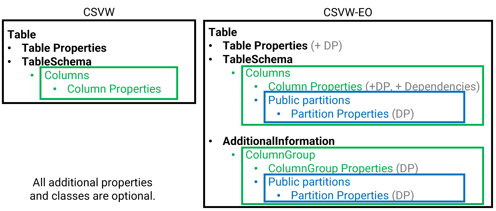

# CSVW-EO

CSVW-EO extends the W3C CSV on the Web (CSVW) standard with
privacy-safe metadata for:

- Differential Privacy contribution modeling
- Structural dataset assumptions
- Dummy data generation
- Public partition/key definitions
- Validation workflows

Documentation:
https://dscc-admin-ch.github.io/csvw-eo-docs/

---

## Why CSVW-EO?

Many datasets cannot be shared directly due to privacy or governance
constraints.

CSVW-EO allows publishing safe assumptions about datasets without
sharing the underlying sensitive data.

Examples include:

- schema information
- nullable proportions
- public partitions
- contribution bounds for DP
- logical dependencies



---

## Repository Structure

| Component | Description |
|---|---|
| `csvw-eo-library/` | Python library |
| `docs/` | MkDocs documentation |
| `csvw-eo-vocab.ttl` | RDF vocabulary |
| `csvw-eo-constraints.ttl` | SHACL validation rules |

---

## Installation

```bash
pip install csvw-eo
```

## Quick Example

```bash
from csvw_eo.make_metadata_from_data import make_metadata_from_data
from csvw_eo.make_dummy_from_metadata import make_dummy_from_metadata

metadata = make_metadata_from_data(
    df,
    privacy_unit="user_id",
)
dummy_df = make_dummy_from_metadata(metadata)
```

## Documentation

| Section        | Link                                                                                                                     |
| -------------- | ------------------------------------------------------------------------------------------------------------------------ |
| Vocabulary     | [https://dscc-admin-ch.github.io/csvw-eo-docs/vocabulary/overview/](https://dscc-admin-ch.github.io/csvw-eo-docs/vocabulary/overview/) |
| Python Library | [https://dscc-admin-ch.github.io/csvw-eo-docs/library/overview/](https://dscc-admin-ch.github.io/csvw-eo-docs/library/overview/)       |
| API Reference  | [https://dscc-admin-ch.github.io/csvw-eo-docs/api/](https://dscc-admin-ch.github.io/csvw-eo-docs/api/)               |
