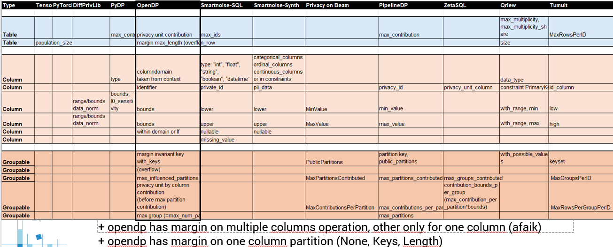

# Library mapping (tentative)

> Terminology varies across DP frameworks.
> PU: Privacy Unit

## Libraries

| DP Library | GitHub / Docs | Belongs to | Forks | Stars | Last Updated | Language | Description |
|-----------|---------------|------------|-------|-------|--------------|----------|-------------|
| DiffPrivLib | Welcome to the IBM Differential Privacy Library — Diffprivlib | IBM | 205 | 899 | 9 months ago | Python | DP statistics + DP ML (scikit-learn–like). |
| OpenDP | Quickstart — OpenDP | Harvard | 64 | 402 | recent | Rust (+ Python / R) | Core library of DP algorithms, transformations, privacy pipelines. |
| SmartNoise-SQL | OpenDP SmartNoise SQL | Microsoft + Harvard | 76 / 2 | 290 / 2 | last year | Python / SQL | DP SQL interface that wraps DB connections, intercepts queries, enforces DP. |
| SmartNoise-Synth | OpenDP SmartNoise Synthesizers | Microsoft + Harvard | 76 / 2 | 290 / 2 | 9 months ago | Python | Synthetic data generation under DP. |
| Google Differential Privacy (Building Blocks) | google/differential-privacy | Google | 399 | 3.2k | recent | Java, Go, C++ | Noise addition and basic aggregations. |
| Google Differential Privacy (Beam) | google/differential-privacy | Google | 399 | 3.2k | recent | Go | Privacy on Beam: DP for Go with Apache Beam. |
| Google Differential Privacy (JVM) | google/differential-privacy | Google | 399 | 3.2k | recent | JVM (Java, Kotlin, Scala) | PipelineDP4j: DP for JVM with Apache Beam and Spark. |
| Google Differential Privacy (SQL) | google/differential-privacy | Google | 399 | 3.2k | recent | SQL CLI | ZetaSQL: DP SQL queries with DP instructions inside queries. |
| Google Differential Privacy (Accounting) | google/differential-privacy | Google | 399 | 3.2k | recent | Python | DP accounting library. |
| Google Differential Privacy (Auditing) | google/differential-privacy | Google | 399 | 3.2k | recent | Python | DP Auditorium: black-box auditing of DP guarantees via hypothesis testing. |
| PyDP | OpenMined/PyDP | OpenMined / Google | 142 | 541 | recent | Python (wrapper) | Python bindings for Google DP C++ (count, sum, mean, quantile, sklearn-style). |
| PipelineDP | OpenMined/PipelineDP | OpenMined / Google | 85 | 283 | recent | Python | Backend-agnostic PipelineDP (Python version of PipelineDP4j). |
| TensorFlow Privacy | tensorflow/privacy | Google | 467 | 2k | recent | Python / TensorFlow | DP training (DP-SGD) for TensorFlow / Keras models. |
| PyTorch Opacus | Opacus | Meta | 389 | 1.9k | recent | Python / PyTorch | DP training (DP-SGD) for PyTorch models. |
| JAX Privacy | google-deepmind/jax_privacy | Google DeepMind | 33 | 141 | recent | Python / JAX / Keras | Differentially private machine learning. |
| Tumult Analytics | opendp/tumult-analytics | OpenDP | NA | NA | recent | Python | Private aggregate queries on tabular data; joins, maps, flatmaps (Python 3.9–3.11). |
| PyQrlew | pyqrlew.readthedocs.io | Sarus | — | 48 | 2 years ago | Python / SQL | DP SQL engine with separate metadata, joins, and many SQL backends. |

## Mapping

